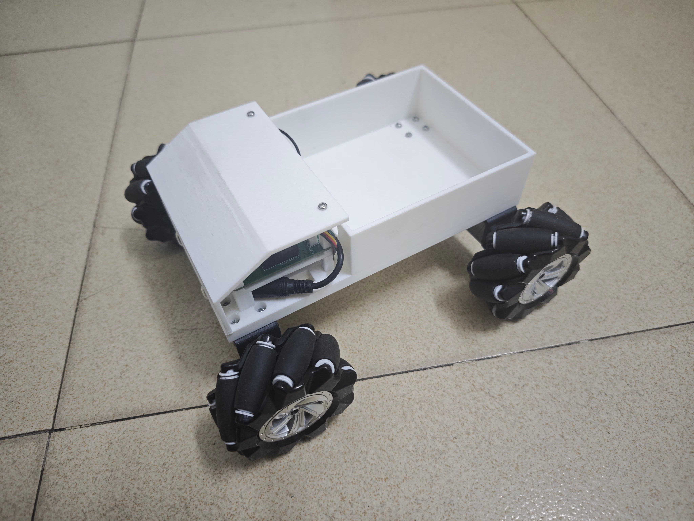
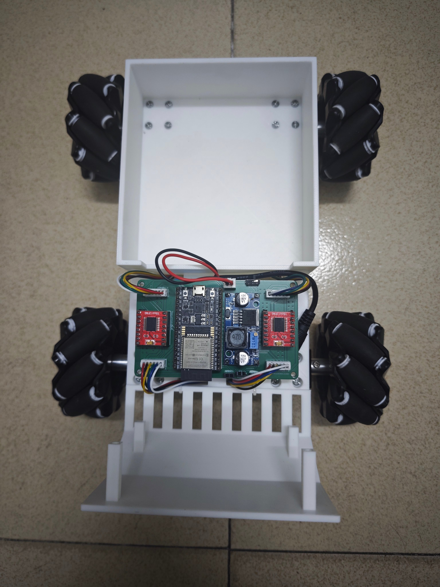
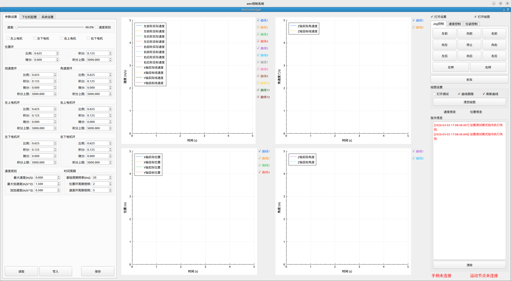

# 项目简介

本项目用于制作遥控麦克纳姆轮小车，使用QT和QBlueTooth开发安卓软件，通过蓝牙遥控小车，同时还基于QT+ROS2开发上位机软件，用于调试小车。下位机使用ESP32-WROOM开发板，使用vscode中的platformio插件基于Arduino框架进行开发。

# 开发环境
- 操作系统：ubuntu22
- ros2版本：humble
- 上位机qt开发版本：5.X
- 安卓qt开发版本：6.5.3
- 下位机vscode插件：platformio
- 三维建模软件：freecad
- 电路设计软件：嘉立创专业版

# 实物展示

## 小车

## 演示动画

## 电路设计和三维建模

## 安卓软件

## 上位机软件

